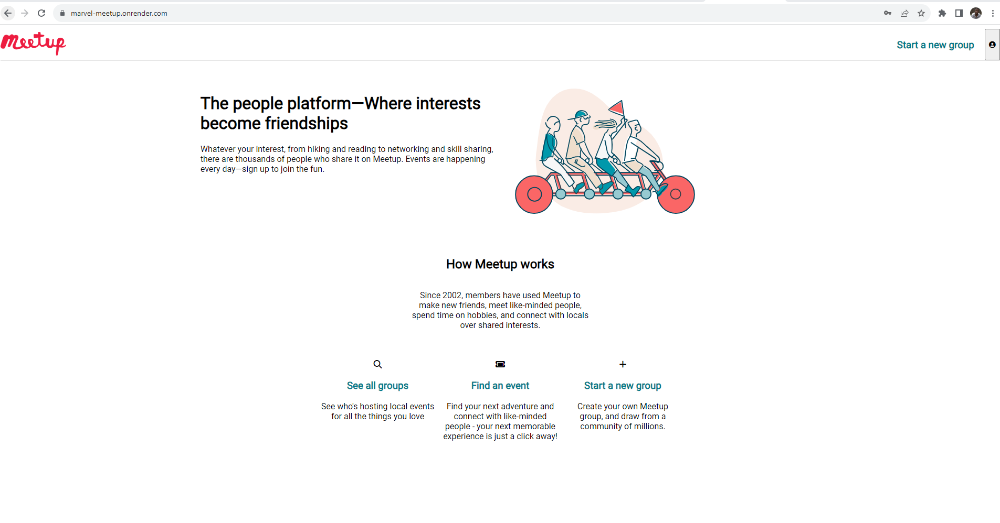

# Marvel Meetup

Marvel Meetup is a website clone of [Meetup](https://www.meetup.com/) populated with content inspired by [Marvel](https://www.marvel.com/). Marvel Meetup allows users to create groups and social events, all while viewing the groups and social events made by other users. [Click here to view Marvel Meetup Live Site](https://marvel-meetup.onrender.com)

## Wiki Link

* [API Routes](https://github.com/regdes721/API-project/wiki/API-routes)
* [Database Schema](https://github.com/regdes721/API-project/wiki/Database-schema)
* [Feature List](https://github.com/regdes721/API-project/wiki/Feature-list)
* [Frontend Routes](https://github.com/regdes721/API-project/wiki/Frontend-routes)

## Languages and Technologies

This is a concise list of what was utilized to develop this project.

* JavaScript
* HTML5
* CSS3
* Express
* Sequelize
* PostgreSQL
* React
* Redux

## Local Instructions

To launch the full application locally:

* Open two terminals
* In the first terminal:
  * cd into the backend folder
  * run the ```npm start``` command in the backend folder
* In the second terminal:
  * cd into the frontend folder
  * run the ```npm run dev``` command in the frontend folder
* Open http://localhost:5173/ in your browser

## Features Directions:

### Home Page Demo User:

You will be able to test the features without sign up by clicking on the "Demo User" button in the Sign Up Modal



## Future Features
* RSVPs
* Joining Groups
* Search by location and group info (name, description)
* Calendar (on group page)
* Calendar (for all groups in search results)
* AWS/S3 Image Upload
* Google Maps
